A **generator** is the central building block of Eventum. It is a self-contained unit that knows *when* to produce events, *what* those events look like, and *where* to send them. You can run a single generator from the command line or dozens in parallel through the application server.

## The three-stage pipeline

Every generator runs a pipeline with three stages connected in sequence:

```
Input → Event → Output
```

Each stage is handled by a [plugin](/docs/core/concepts/plugins) — a swappable component that you pick and configure in YAML. The stages are deliberately independent: changing when events happen doesn't affect what they contain, and adding a new destination doesn't require touching the schedule or the template.

### Input — *when* events happen

An input plugin produces **timestamps** — the moments in time when events should occur. Different plugins offer different scheduling strategies:

| Plugin | Produces timestamps... |
|--------|----------------------|
| `cron` | at moments defined by a cron expression |
| `timer` | at fixed intervals (every N seconds) |
| `linspace` | evenly spread across a date range |
| `time_patterns` | following statistical distributions that mimic real traffic |
| `timestamps` | from an explicit list of datetimes |
| `static` | all at once, using the current time |
| `http` | on demand, triggered by an HTTP request |

A generator can have **multiple input plugins** working simultaneously. Their timestamps are merged into a single stream before reaching the event stage. Each input plugin can attach **tags** to its timestamps so the event stage knows which source produced them.

See [Scheduling](/docs/core/concepts/scheduling) for the full reference.

### Event — *what* events look like

An event plugin takes each timestamp and turns it into one or more event strings. Eventum provides three event plugins:

- **template** — renders [Jinja2](https://jinja.palletsprojects.com/) templates with access to [Faker](https://faker.readthedocs.io/), [Mimesis](https://mimesis.name/), random helpers, sample datasets, and persistent state. This is the primary way to generate events and covers most use cases.
- **script** — executes a Python function, giving you full programmatic control when templates aren't enough.
- **replay** — reads events from an existing log file and optionally replaces timestamps.

A generator has exactly **one event plugin**.

See [Producing events](/docs/core/concepts/producing) for the full reference.

### Output — *where* events go

An output plugin receives rendered events and writes them to a destination:

| Plugin | Sends events to... |
|--------|-------------------|
| `stdout` | the console (or stderr) |
| `file` | a local file |
| `http` | any HTTP endpoint |
| `opensearch` | an OpenSearch cluster |
| `clickhouse` | a ClickHouse database |

A generator can have **multiple output plugins**. Every event is delivered to all configured outputs — you don't need to duplicate generators to write the same data to a file and an HTTP endpoint. Each output plugin can apply a **formatter** (plain text, JSON, JSON batch, or a custom Jinja2 template) to transform events before writing.

See [Outputting events](/docs/core/concepts/output) for the full reference.

## Generator configuration

A generator is defined by a single YAML file with three top-level keys matching the pipeline stages:

```yaml title="generator.yml"
input:
  - cron:
      expression: "* * * * * *"
      count: 1

event:
  template:
    mode: all
    templates:
      - my_event:
          template: templates/event.jinja

output:
  - stdout: {}
  - file:
      path: output/events.log
      flush_interval: 1
```

- **`input`** is a list — you can combine multiple input plugins.
- **`event`** is a single object — one plugin with its settings.
- **`output`** is a list — events go to every output in the list.

Each plugin is identified by its name (`cron`, `template`, `stdout`, etc.) and configured with a nested object of plugin-specific settings. See [Configuration files](/docs/core/config/files) for the full reference.

### Variable substitution

Generator configs support `${params.name}` and `${secrets.name}` tokens. Parameters are passed at runtime (via CLI flags or the startup config), while secrets are resolved from the encrypted [keyring](/docs/core/cli/eventum-keyring). This lets you reuse the same config across environments without hard-coding values:

```yaml
output:
  - opensearch:
      hosts:
        - ${params.opensearch_host}
      password: ${secrets.opensearch_password}
```

See [Variables](/docs/core/config/vars) for details.

## Execution modes

A generator can run in one of two modes:

### Live mode (default)

Events are emitted **at the actual moments** defined by their timestamps, synchronized with the wall clock. If the input plugin says "event at 12:00:05", the generator waits until 12:00:05 to produce and deliver it.

This mode is designed for:
- Simulating real-time traffic against a live system
- Feeding a SIEM or monitoring tool with a continuous event stream
- Stress-testing a pipeline at a controlled, realistic rate

By default, timestamps in the past are skipped (`skip_past: true`), so the generator starts producing from "now" forward.

### Sample mode

All events are generated **as fast as possible**, regardless of what the timestamps say. A cron expression that would take an hour in live mode can produce its full output in seconds.

This mode is designed for:
- Seeding a database with historical data
- Creating test datasets
- Backfilling a time range after an outage

Switch between modes with a single flag:

```bash
# Live mode (default)
eventum generate --id my-gen --path generator.yml ... --live-mode

# Batch mode
eventum generate --id my-gen --path generator.yml ... --no-live-mode
```

## How it works under the hood

Understanding the internal flow isn't required to use Eventum, but it helps when tuning performance or debugging.

A generator runs its pipeline in a dedicated thread. Inside that thread, an async executor manages three concurrent tasks connected by two queues:

```mermaid
graph LR
    Input["🕐 Input\nwhen events happen"]
    TQ[/"timestamps\nqueue"/]
    Event["📄 Event\nwhat events look like"]
    EQ[/"events\nqueue"/]
    Output["📤 Output\nwhere events go"]

    Input --> TQ --> Event --> EQ --> Output
```



1. The **input task** collects timestamps from all input plugins, merges them in chronological order, groups them into batches, and (in live mode) waits until the right moment before releasing each batch into the timestamps queue.

2. The **event task** reads timestamp batches, calls the event plugin's `produce` function for each timestamp, and puts the resulting event strings into the events queue.

3. The **output task** reads event batches and writes them to all output plugins concurrently, respecting a configurable concurrency limit.

The two queues provide natural **backpressure**: if the event plugin is slower than the input, the timestamps queue fills up and the input task pauses. If the output is slower than the event plugin, the events queue fills up and event production pauses. This prevents memory from growing unboundedly without dropping events.

### Tuning parameters

| Parameter | Default | What it controls |
|-----------|---------|-----------------|
| `batch.size` | `10000` | Max timestamps per batch — larger batches reduce overhead but increase latency |
| `batch.delay` | `1.0` | Max seconds to accumulate timestamps before flushing a partial batch |
| `queue.max_timestamp_batches` | `10` | Timestamps queue depth — more buffering between input and event stages |
| `queue.max_event_batches` | `10` | Events queue depth — more buffering between event and output stages |
| `max_concurrency` | `100` | Max parallel output write operations |
| `write_timeout` | `10` | Seconds before canceling a slow output write |
| `keep_order` | `false` | When `true`, output writes are serialized to maintain strict chronological order (slower but ordered) |

These parameters are set either via CLI flags (`eventum generate --batch.size 5000`) or in the application config under `generation.*`. See [eventum.yml](/docs/core/config/files/eventum-yml) for details.

## Running multiple generators

When you need more than one generator — different event types, different schedules, different destinations — use `eventum run` to launch the full application. Each generator runs in its own thread with independent pipelines, queues, and plugins. They don't share state unless you explicitly use the `globals` variable in templates.

The [startup config](/docs/core/config/files/startup-yml) lists all generators and lets you override parameters per generator:

```yaml title="startup.yml"
- id: access-logs
  path: generators/access-logs/generator.yml
  live_mode: true

- id: error-logs
  path: generators/error-logs/generator.yml
  live_mode: true

- id: backfill
  path: generators/backfill/generator.yml
  autostart: false
  live_mode: false
```

Generators with `autostart: false` are loaded but not started — you can start them later through the [REST API](/docs/api) or [Studio](/docs/studio).

## What's next

<Cards>
  <Card
    title="Plugins"
    description="How the plugin system works — types, registration, and configuration."
    href="/docs/core/concepts/plugins"
  />
  <Card
    title="Scheduling"
    description="All input plugins and how they control when events happen."
    href="/docs/core/concepts/scheduling"
  />
  <Card
    title="Producing events"
    description="Template engine, Python scripts, and log replay."
    href="/docs/core/concepts/producing"
  />
  <Card
    title="Outputting events"
    description="Output plugins, formatters, and event ordering."
    href="/docs/core/concepts/output"
  />
</Cards>
